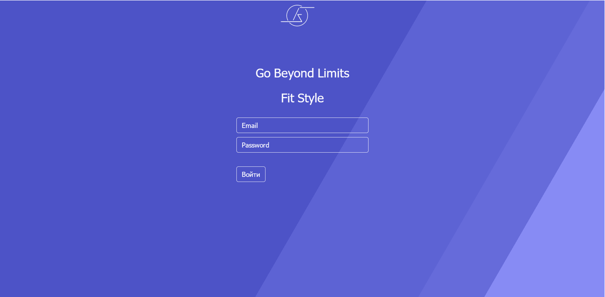
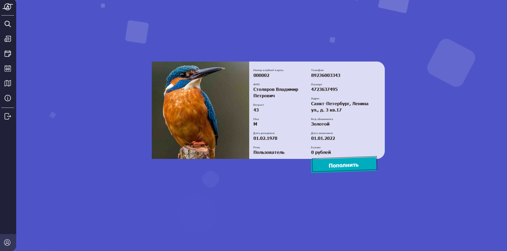
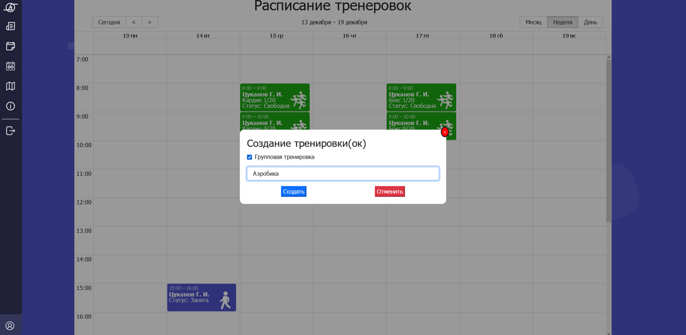
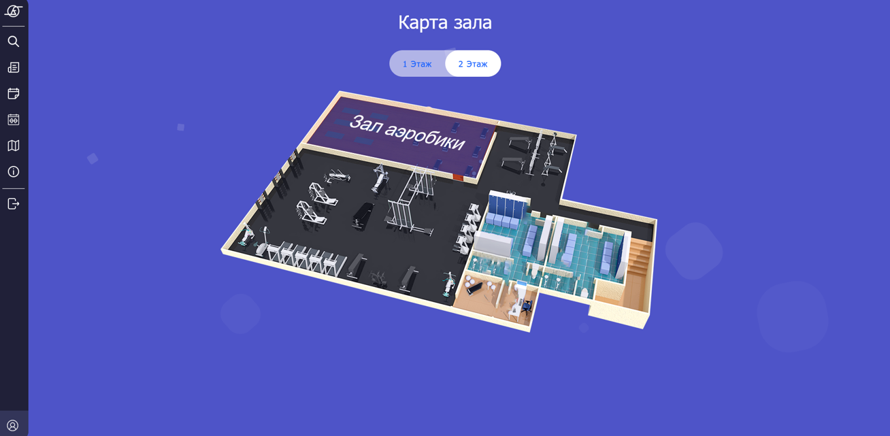
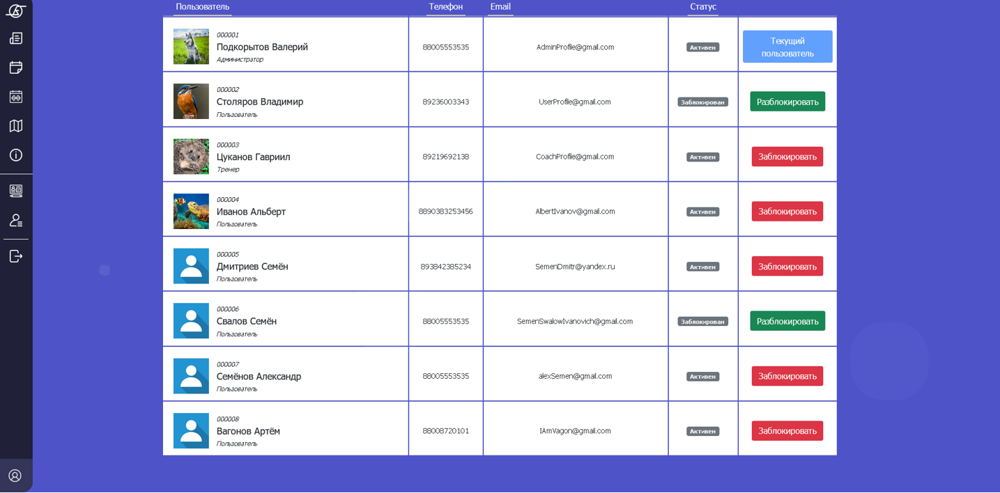

# On Board
## 편리하게 일정을 공유해 보세요.

## Why do we need this app?
보드 관련 공지와 뉴스를 제공합니다.
그룹 회원들 간의 편리한 일정 공유를 제공합니다.
동일한 관심사의 새로운 동료들과 함께하세요.

## Web application functionality
- Profile, which displays information about the user (Name, photo, account balance)  
- Publication of news and other company information (News feed)  
- Viewing the work schedule of employees  
- Selection of training grounds/halls  
- View an individual calendar with workouts and meetings  
- Viewing and possibility of communication (correspondence) with company employees, chat with support  
- The opportunity to find out where the sports grounds/halls are located (a fitness club map showing the numbers of all halls)  
- Viewing company information  
- Each client has a personal account, to pay for services (training), the client can top up his account with a bank card.  

## 기술 스택
##### FrontEnd:
- HTML + CSS + JS
- Node.js (for React.js)
- React.js 
- Bootstrap 5
- Axios
##### BackEnd:
- Java
- Spring Data JPA
- Spring MVC
- PostgreSQL 

## Preview

### Authorization page

### User Profile

### Training tab

### Map

### Users tab

---
