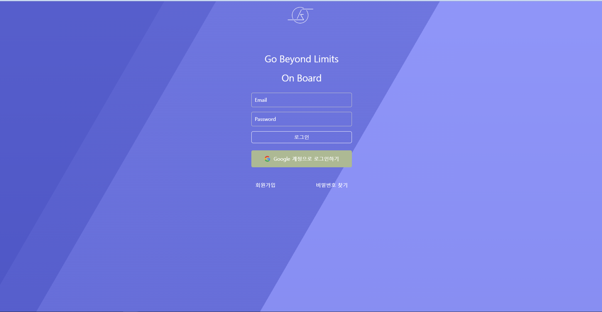
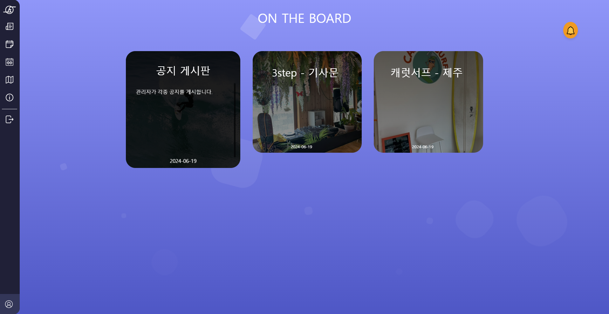
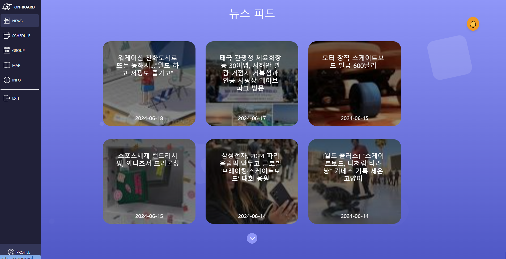
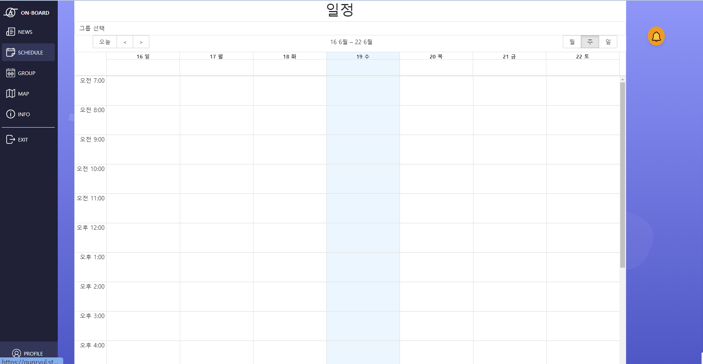
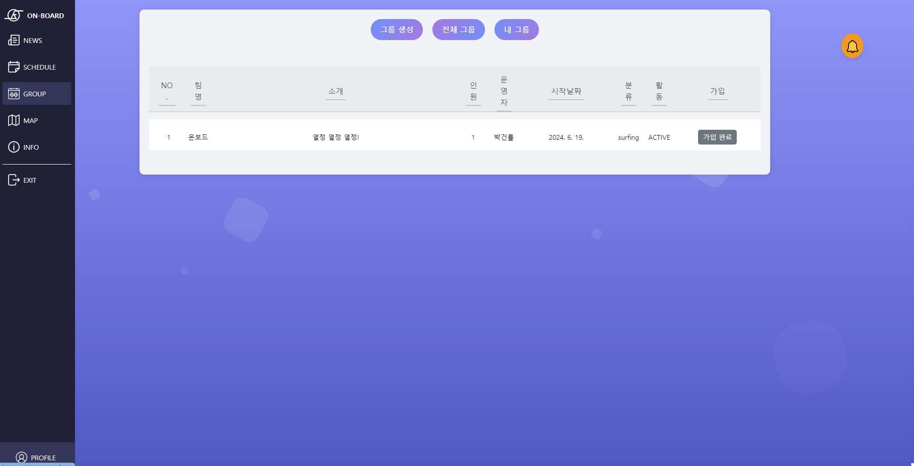
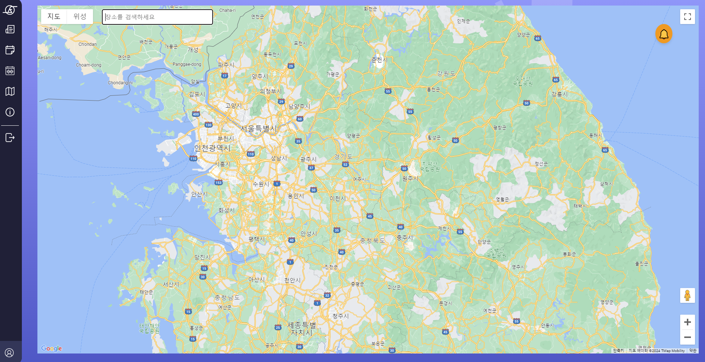
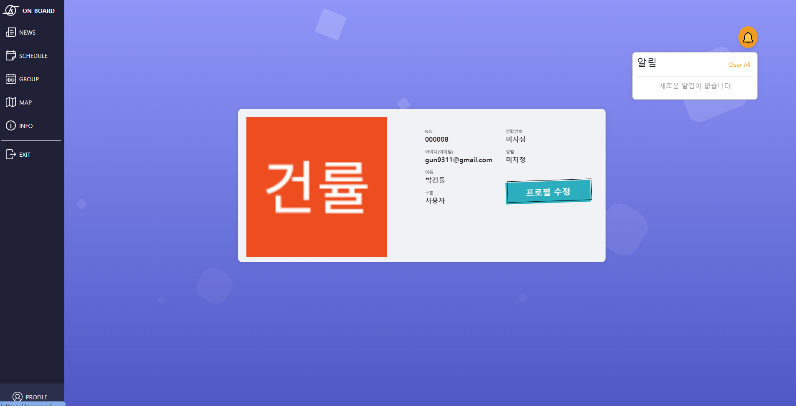

# On Board - 편리하게 취미 일정을 공유해 보세요.

## 웹 사이트
[On-Board](https://gunryul.store/)

## 웹 애플리케이션 기능
- 사용자 정보(이름, 사진 등)를 표시하는 프로필
- 관련 최신 뉴스를 게시하는 뉴스 피드(클릭 시 본문으로 이동)
- 팀 회원의 시공간 일정을 공유
- 그룹 개설 및 참여
- 사용자 이벤트에 따른 알림 기능
- 구글 맵과 검색 기능
  
## 기술 스택
##### FrontEnd:
- HTML + CSS + JS
- Node.js (for React.js)
- React.js 
- Bootstrap 5
- Axios
##### BackEnd:
- Java
- Spring Data JPA
- Spring MVC
- PostgreSQL 

## Preview

### 로그인

### 메인 게시판

### 뉴스 피드

### 일정

### 그룹

### 지도

### 프로필

---
